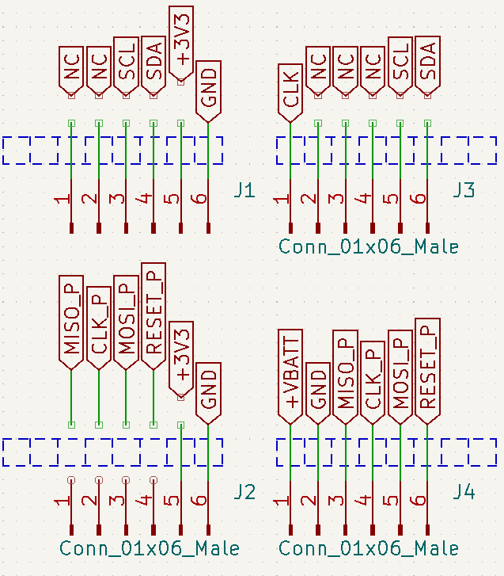

# Hack-in-the-box 2022 Programming Guide
- This has been test with Arduino IDE 1.8.18

## Installing Libraries
- Install the ATtiny code by adding this url to the Additional Board Manager URLS: http://drazzy.com/package_drazzy.com_index.json
- More info on this library at https://github.com/SpenceKonde/ATTinyCore

## Programming Connections
- When looking down at the board from above only the lower right six pins are used for programming.

## Flashing Configuration
