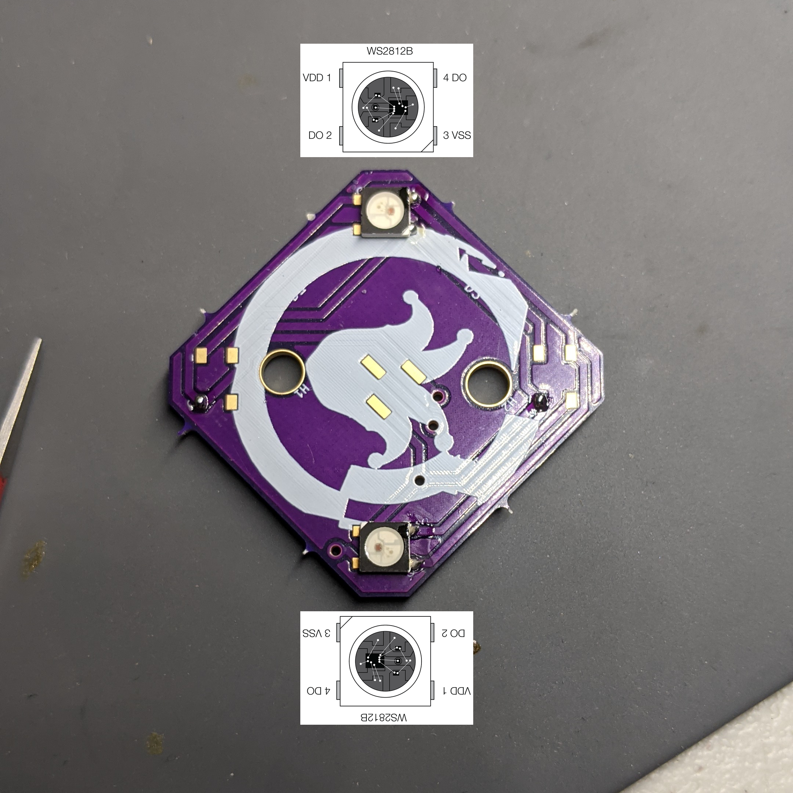
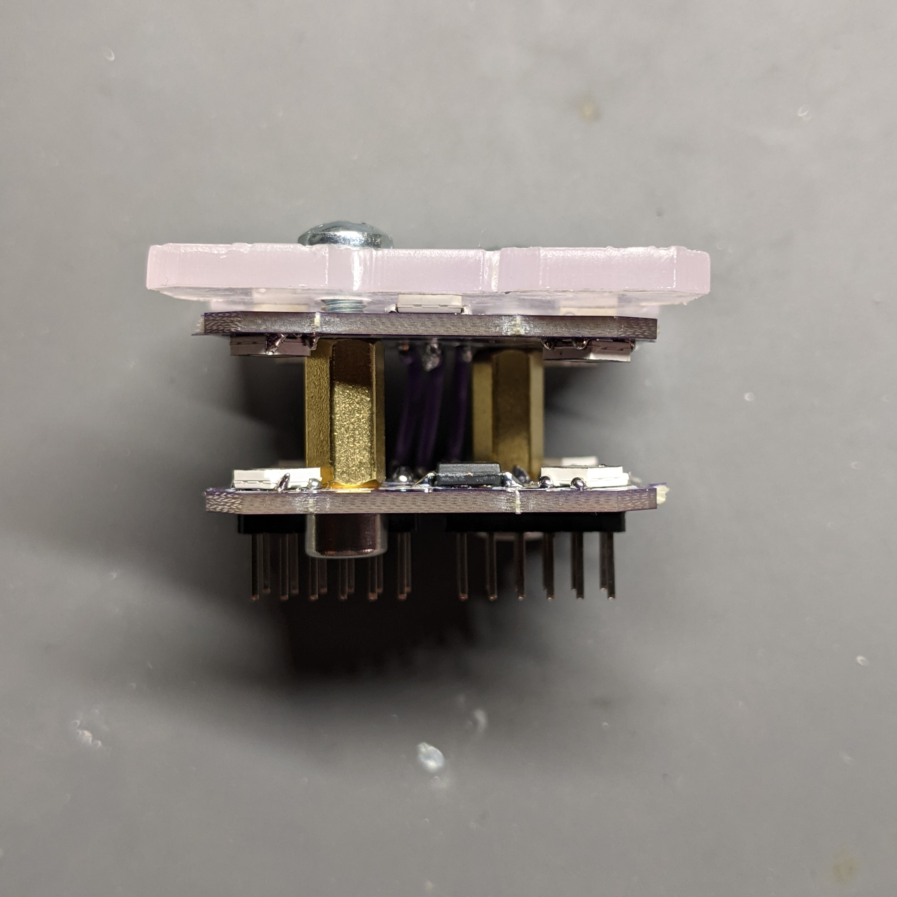
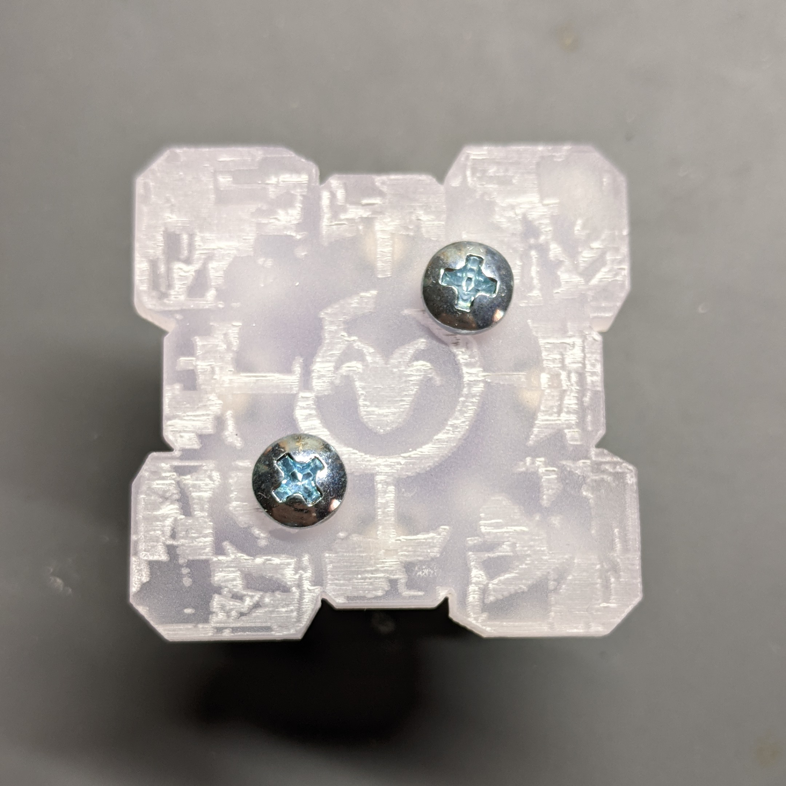

# Hack-in-the-box 2022 Badge Guide

## Assembly

### Step 1
- Solder the attiny85 to the base pcb.

### Step 2
- Solder the first two leds on the base pcb.

### Step 3
- Solder the last two leds on the base pcb.

### Step 4
- Solder the first two leds on the top of the upper pcb.

### Step 5
- Solder the next two leds on the top of the upper pcb.

### Step 6
- Solder the first two leds on the bottom of the upper pcb.

### Step 7
- Solder the last two leds on the upper pcb.

### Step 8
- Solder the headers on the board by first placing them in the expansion board or similar and then slide the board on to ensure good fit.

### Step 9

### Step 10
- Remove the stripped ends of the three solid-core wires and attach them to the base pcb.

### Step 11
- Solder the solid-core wires to the top. The easiest way is to solder the outer two wires, bend them all 90 degrees, then solder the middle one.

### Step 12
- Attach the stand offs to the base pcb with the socket cap screws.

### Step 13

### Step 14
- With the other screws attach the acrylic and the upper pcb to the standoffs.

### Step 15

